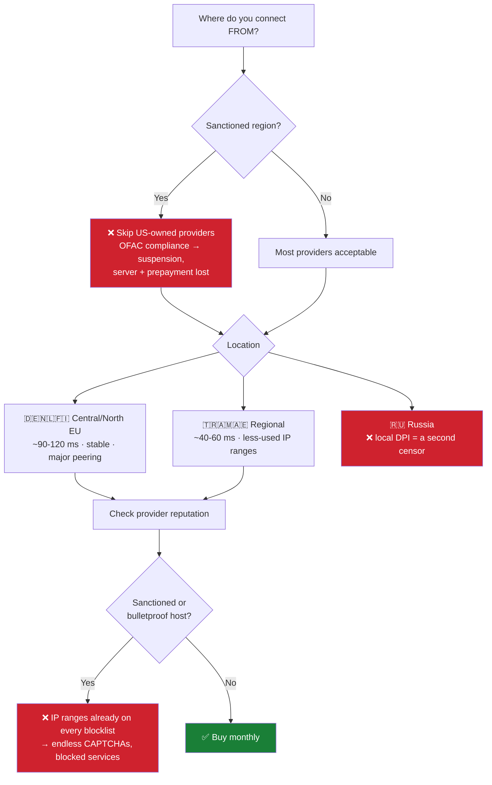

# 01 — VPS selection

The provider and the IP matter more than any config setting. A flawless config on a blacklisted IP is worthless.

## Decision order

## Specs that matter (and don't)

| Spec | Target | Impact |
|---|---|---|
| Port speed | **≥ 1 Gbps** | 🔥 Highest. A 10–50 Mbps port caps everything downstream |
| Virtualization | **KVM** | 🔥 High. OpenVZ/LXC can't load `tcp_bbr` and is oversold |
| Bandwidth | Unlimited / ≥ 2 TB | 🔥 High. Proxy traffic *is* the workload |
| RAM | 1 GB | Low. Xray + panel are tiny; more RAM changes nothing |
| vCPU | 1 | Low |
| Disk | 10 GB | Low |
| DDoS protection | **off** | Negative — scrubbing hurts latency and TLS handshakes |
| Datacenter | Known operator | Medium. A recognizable DC beats an anonymous node |

## Search-filter pitfalls

Aggregator catalogs hold incomplete records. **Every filter you add also removes providers who simply left that field empty.**

| Symptom | Fix |
|---|---|
| `Results Found: 0` | Remove filters one at a time — "unlimited bandwidth" and "payment method" are the usual culprits |
| Two identical prices, wildly different specs | Catalog data is second-hand — always re-verify on the provider's own site |
| Impossible combinations | E.g. "≥10 GB RAM under $14" — check the slider you dragged by accident |

## Do not buy

| Upsell | Why not |
|---|---|
| Control panel license | Useless here; expands attack surface |
| SSL certificate | Reality needs none; Let's Encrypt is free |
| DNS hosting | Cloudflare already does it |
| Extra IPs | One is enough |
| Backups | Rebuild is ~15 minutes |
| DDoS protection | Costs more, hurts latency |

## Before you pay

1. Ask support whether **IP replacement** is possible and what it costs. Their answer is the most valuable thing you can learn about them.
2. Read the fine print. Many providers explicitly disclaim responsibility if an IP is unreachable from a given country — meaning **no refund** for a blocked IP.
3. Buy **one month**. Prove the IP first.
4. Note the true cost: list price **+ gateway commission (~10 %) + FX fee (~2.5 %)**.

## Billing traps

| Trap | Consequence |
|---|---|
| Auto-renewal off | Server deleted → IP lost → all client links must be rebuilt |
| Gateway credits *balance*, not the *invoice* | Order stuck in "Awaiting payment" while your money sits in the wallet |
| Retrying a "failed" payment | Multiple authorization holds; some post as real charges |
| Topping up repeatedly | Fees paid twice; open a ticket instead of retrying |

> After topping up, pay the invoice **from account balance** — do not re-run the card.
