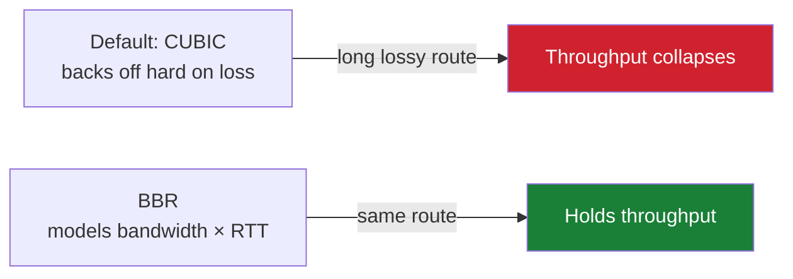

# 02 — Server preparation

Ubuntu 22.04 LTS, root over SSH. Do these in order — BBR before the panel install.

## 1. Base packages

```bash
apt update && apt upgrade -y
apt install -y curl socat
```

### The `needrestart` interruption

```
Daemons using outdated libraries
--------------------------------
  1. getty@tty1.service  2. user@0.service
(Enter the items or ranges you want to select, separated by spaces.)
Which services should be restarted?
```

Answer `1 2`. Safe — `sshd` is absent from the list, so your session survives. It may ask again for a later package batch; answer the same way.

Silence it permanently:

```bash
sed -i "s/#\$nrconf{restart} = 'i';/\$nrconf{restart} = 'a';/" /etc/needrestart/needrestart.conf
```

## 2. Enable BBR

BBR replaces the default CUBIC congestion control. On long international paths with packet loss, this is the highest-impact single change available.



```bash
modprobe tcp_bbr
cat >> /etc/sysctl.conf <<'EOF'
net.core.default_qdisc=fq
net.ipv4.tcp_congestion_control=bbr
EOF
sysctl -p
```

**Verify — this step is not optional:**

```bash
sysctl net.ipv4.tcp_congestion_control
```

| Output | Meaning |
|---|---|
| `= bbr` | ✅ Active |
| `= cubic` | ❌ Not applied — re-run the block. On OpenVZ/LXC it can never work; you bought the wrong virtualization |

## 3. Kernel reboot

Upgrades often stage a new kernel that only loads after a restart:

```
Pending kernel upgrade
The currently running kernel version is 5.15.0-177-generic which is not the
expected kernel version 5.15.0-187-generic.
```

```bash
ls /var/run/reboot-required && reboot
```

Wait ~30 s and reconnect. Re-verify BBR after every kernel change.

## 4. Post-setup sanity check

```bash
sysctl net.ipv4.tcp_congestion_control    # bbr
uname -r                                  # matches the expected kernel
free -m                                   # ~1 GB
df -h /                                   # disk present
```
