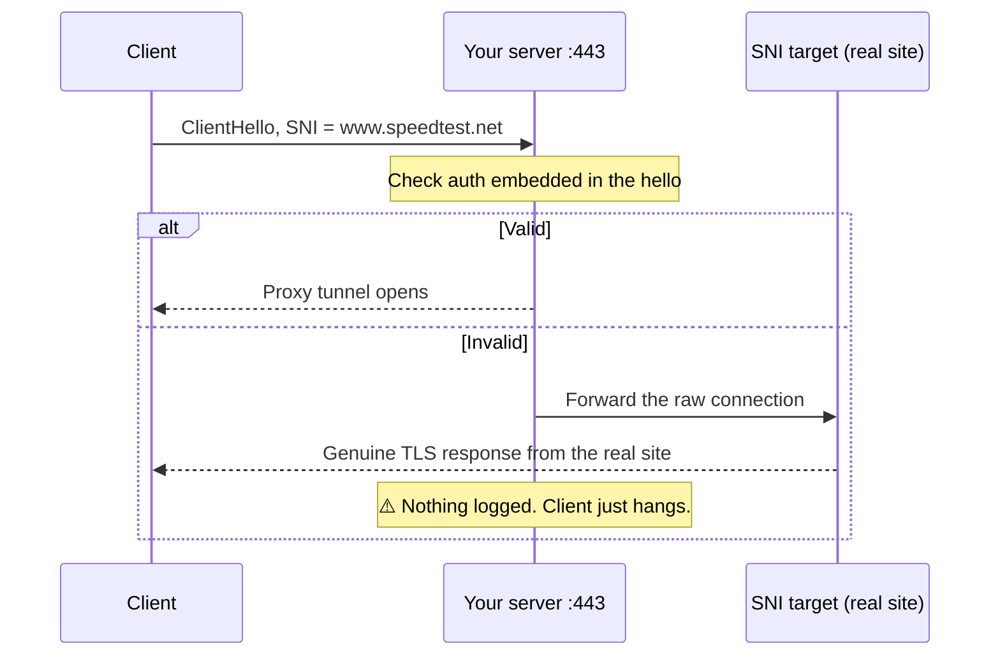
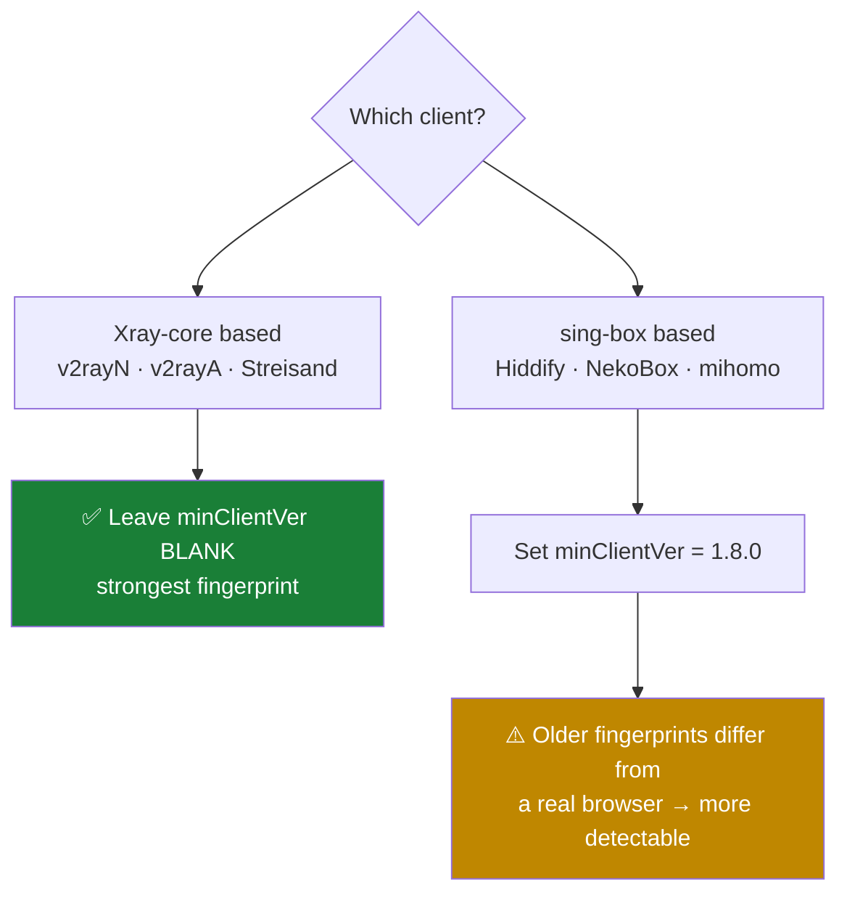

# 03 — Path A: VLESS + Reality

## What Reality actually does

Reality does not present *your* certificate. It borrows the TLS handshake of a real, unrelated website. To an observer, a connection to your server is indistinguishable from a genuine visit to that site — same certificate chain, same fingerprint, same everything.



**Consequence:** Reality cannot be debugged from logs. Failures are indistinguishable from each other and from silence. Debug by elimination only.

## Choosing the SNI target

| Requirement | Reason |
|---|---|
| Supports TLS 1.3 + X25519 | Reality requires it |
| Not owned by you | Must be a real third-party site |
| Not blocked where you connect from | If your ISP blocks it, the disguise fails |
| Geographically sensible for the server | A German server talking to a Japanese site is odd |
| Popular, high-traffic | Blends in |

Common choices: `www.speedtest.net`, `www.microsoft.com`, `www.lovelive-anime.jp`, `dl.google.com`.

Verify a candidate:

```bash
xray tls ping www.speedtest.net
```

## Field reference

### Basics
| Field | Value |
|---|---|
| Protocol | `vless` |
| **Address** | **BLANK** — bind address, not the public hostname |
| Port | `443` |

### Protocol
| Field | Value |
|---|---|
| Decryption | `none` — press **Clear** if pre-filled with `mlkem768x25519plus...` |
| Encryption | empty |

### Stream
| Field | Value |
|---|---|
| Transmission | `RAW` (TCP) |

### Security → Reality
| Field | Value |
|---|---|
| Target (`dest`) | `www.speedtest.net:443` |
| SNI / Server Names | `www.speedtest.net` (no port) |
| uTLS | `chrome` |
| Public / Private key | **Generate** |
| Short IDs | exactly one |
| SpiderX | default |
| Min Client Ver | blank (or `1.8.0` — see below) |
| Max Client Ver | blank |

### Client
| Field | Value |
|---|---|
| Flow | `xtls-rprx-vision` |

## The `minClientVer` trap

Recent Xray-core versions apply a **default** minimum client version to Reality inbounds even when the field is empty. Clients that don't report a modern Xray version — anything sing-box-based, and mihomo — are rejected silently.

```
[Warning] infra/conf: REALITY: The default minimal client version is Xray-core vXX.X.XX,
other clients may be refused to connect
```



**Recommendation:** switch clients rather than lowering the value. If you do lower it, treat it as temporary and revert once you have an Xray-core client.

## Link template

```
vless://UUID@SERVER_IP:443
  ?type=tcp
  &security=reality
  &encryption=none
  &pbk=PUBLIC_KEY
  &fp=chrome
  &sni=www.speedtest.net
  &sid=SHORT_ID
  &spx=%2F
  &flow=xtls-rprx-vision
#Reality-Direct
```

(All on one line in practice.) Always export from the panel — a single mistyped character in `pbk` or `sid` fails silently and identically to every other Reality error.
