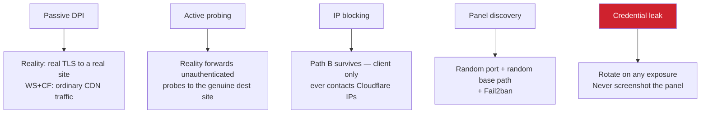

# 06 — Security hardening

## Rotate everything that ever left the server

Credentials leak through screenshots, pasted terminal output, chat logs, and issue reports. Anything that has been outside a password manager should be considered burned.

| Secret | How to rotate |
|---|---|
| Panel username / password | `x-ui` → menu → reset credentials |
| Panel web base path | `x-ui` → menu → change base path |
| Panel API token | `x-ui` → menu → regenerate |
| Reality keypair | Inbound → Security → **Generate** → re-export every client link |
| Client UUID | Inbound → client → regenerate → redistribute |
| Cloudflare API token | Dashboard → API Tokens → Roll |

> A screenshot of the panel is a credential leak. Private keys, UUIDs and tokens are all readable in images.

## Baseline

| Item | Setting |
|---|---|
| Panel port | Non-default, ≥ 5 digits, ≤ 65535 |
| Web base path | Long and random — the panel 404s without it |
| Key permissions | `chmod 600 /root/cert/*.key` |
| SSH | Key-based auth; `PasswordAuthentication no` |
| Fail2ban | Installed by 3x-ui for the IP-limit feature — leave enabled |
| Panel exposure | Prefer an SSH tunnel or an IP allowlist over public access |
| `minClientVer` | Blank once you use an Xray-core client |

## Threat model



## SSH tunnel access to the panel (optional, strongest)

Install with SSL option 4 (skip), keep the panel on plain HTTP bound locally, and reach it through:

```bash
ssh -L 8080:127.0.0.1:PANEL_PORT root@SERVER_IP
```

Then browse `http://127.0.0.1:8080/WEB_PATH`. The panel is then unreachable from the internet entirely.
